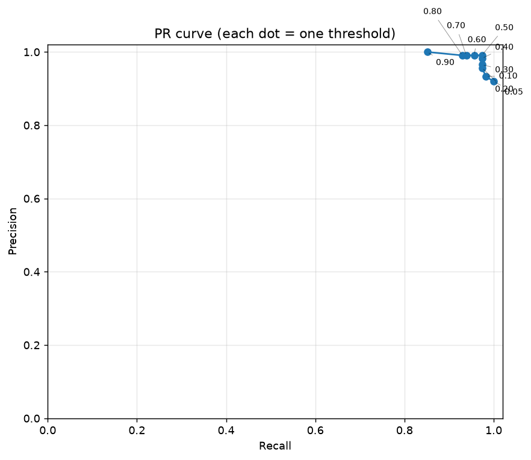

# YOLOv8 六类手势检测实验

本项目实现了一条完整的 YOLOv8 手势检测流程，包括数据准备、迁移学习、验证集阈值评估，以及基于连续帧的稳定触发。目标类别为：

`like`、`stop`、`fist`、`hand_heart`、`timeout`、`xsign`。

## 实验结果

模型使用 YOLOv8n 预训练权重，在 486 张训练图像上训练 30 轮，并在按拍摄者隔离的 114 张验证图像上评估。

| 指标 | 结果 |
|---|---:|
| mAP@0.5 | 0.990 |
| mAP@0.5:0.95 | 0.855 |
| 最佳 F1 阈值 | 0.50 |
| Precision / Recall / F1（阈值 0.50） | 0.991 / 0.974 / 0.982 |

| 类别 | AP@0.5 |
|---|---:|
| like | 0.990 |
| stop | 0.995 |
| fist | 0.967 |
| hand_heart | 0.995 |
| timeout | 0.995 |
| xsign | 0.995 |



## 技术流程

```text
原始图像 + 拍摄者元数据
          │
          ▼
区域模型辅助标注 ──► YOLO 格式数据集
          │              │
          │              ├── 按拍摄者划分 train / val
          │              └── 坐标归一化与完整性检查
          ▼
YOLOv8n 迁移学习 ──► 验证集评估 ──► 阈值扫描
                                      │
                                      ▼
                              连续帧确认 + 冷却机制
```

按拍摄者划分训练集和验证集可避免同一人物、衣着和背景同时出现在两边，从而降低数据泄漏造成的指标虚高。

阈值扫描采用类别一致且 IoU ≥ 0.5 的一对一匹配规则统计 TP、FP、FN。阈值从 0.05 提高到 0.90 时，Precision 从 0.919 总体升至 1.000，Recall 从 1.000 降至 0.851。阈值 0.50 在本次验证集上取得最高 F1。

实时触发层默认要求同一类别连续出现 5 帧，并在触发后冷却 40 帧。时间平滑可以抑制单帧抖动和重复触发，但会增加响应延迟，也可能提高漏检率。

## 文件结构

| 文件 | 用途 |
|---|---|
| `inference.py` | 单图推理并保存带框结果 |
| `prepare_dataset.py` | 辅助标注、按拍摄者划分并生成 YOLO 数据集 |
| `train.py` | 训练并验证六类检测模型 |
| `evaluate_thresholds.py` | 扫描置信度阈值并绘制 PR 曲线 |
| `temporal_demo.py` | 数据集模拟流或摄像头实时触发 |
| `requirements.txt` | Python 依赖 |

## 环境与运行

```powershell
# Windows
setup.bat

.venv\Scripts\python.exe inference.py
.venv\Scripts\python.exe prepare_dataset.py
.venv\Scripts\python.exe train.py
.venv\Scripts\python.exe evaluate_thresholds.py
.venv\Scripts\python.exe temporal_demo.py --headless
```

```bash
# macOS / Linux
./setup.sh

./.venv/bin/python inference.py
./.venv/bin/python prepare_dataset.py
./.venv/bin/python train.py
./.venv/bin/python evaluate_thresholds.py
./.venv/bin/python temporal_demo.py --headless
```

默认目录约定：

```text
raw/images/                  原始图像
raw/meta.json                {图像文件名: 拍摄者编号}
weights/region.pt            区域辅助标注模型
weights/yolov8n.pt           YOLOv8n 预训练权重
weights/gestures.pt          可选的现成六类模型
dataset/                     生成的数据集
runs/normal/weights/best.pt  训练得到的最佳权重
```

原始数据、模型权重和训练产物未包含在仓库中。

## 数据与第三方组件

实验数据来源于 [HaGRID](https://github.com/hukenovs/hagrid)。请从原始项目获取数据，并遵守其许可和署名要求。本仓库不分发 HaGRID 图片、人物元数据或第三方模型权重。

Ultralytics、PyTorch、OpenCV、Matplotlib 等依赖均由各自项目独立提供并适用其各自许可证。本仓库仅记录技术实现和实验结果。
